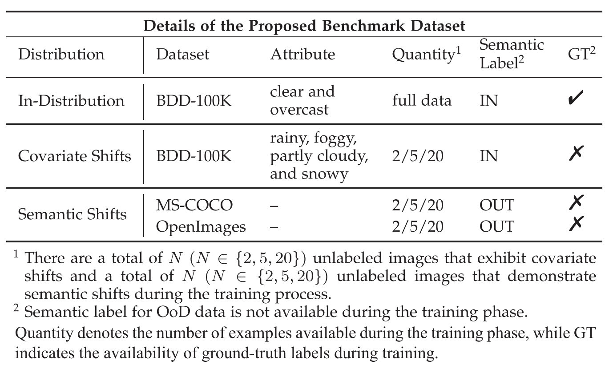

# InfoBound on Object Detection

This is the source code accompanying the paper [***InfoBound: A Provable Information-Bounds Inspired Framework for Both OoD Generalization and OoD Detection***](https://ieeexplore.ieee.org/abstract/document/11112669) 


The codebase is heavily based on [SIREN](https://github.com/deeplearning-wisc/siren) and [detr](https://github.com/facebookresearch/detr).

## Dataset Preparation for OoD Detection

**PASCAL VOC**

Download [Pascal VOC](http://host.robots.ox.ac.uk/pascal/VOC/) dataset (2012trainval, 2007trainval, and 2007test):

```bash
mkdir VOC_DATASET_ROOT
cd VOC_DATASET_ROOT
wget http://host.robots.ox.ac.uk:8080/pascal/VOC/voc2012/VOCtrainval_11-May-2012.tar
wget http://host.robots.ox.ac.uk/pascal/VOC/voc2007/VOCtrainval_06-Nov-2007.tar
wget http://host.robots.ox.ac.uk/pascal/VOC/voc2007/VOCtest_06-Nov-2007.tar
tar -xvf VOCtrainval_11-May-2012.tar
tar -xvf VOCtrainval_06-Nov-2007.tar
tar -xvf VOCtest_06-Nov-2007.tar
```

The VOC dataset folder should have the following structure:
<br>

     └── VOC_DATASET_ROOT
         |
         ├── VOCdevkit/
              ├── VOC2007
              └── VOC2012

**COCO**

Download COCO2017 dataset from the [official website](https://cocodataset.org/#home). 

Download the OOD dataset (json file) when the in-distribution dataset is Pascal VOC from [here](https://drive.google.com/file/d/1Wsg9yBcrTt2UlgBcf7lMKCw19fPXpESF/view?usp=sharing). 

Download the OOD dataset (json file) when the in-distribution dataset is BDD-100k from [here](https://drive.google.com/file/d/1AOYAJC5Z5NzrLl5IIJbZD4bbrZpo0XPh/view?usp=sharing).

Put the two processed OOD json files to ./anntoations

The COCO dataset folder should have the following structure:
<br>

     └── COCO_DATASET_ROOT
         |
         ├── annotations
            ├── xxx (the original json files)
            ├── instances_val2017_ood_wrt_bdd_rm_overlap.json
            └── instances_val2017_ood_rm_overlap.json
         ├── train2017
         └── val2017

**BDD-100k**

Donwload the BDD-100k images from the [official website](https://bdd-data.berkeley.edu/).

Download the processed BDD-100k json files from [here](https://drive.google.com/file/d/1ZbbdKEakSjyOci7Ggm046hCCGYqIHcbE/view?usp=sharing) and [here](https://drive.google.com/file/d/1Rxb9-6BUUGZ_VsNZy9S2pWM8Q5goxrXY/view?usp=sharing).

The BDD dataset folder should have the following structure:
<br>

     └── BDD_DATASET_ROOT
         |
         ├── images
         ├── val_bdd_converted.json
         └── train_bdd_converted.json

**OpenImages**

Download our OpenImages validation splits [here](https://drive.google.com/file/d/1UPuxoE1ZqCfCZX48H7bWX7GGIJsTUrt5/view?usp=sharing). We created a tarball that contains the out-of-distribution data splits used in our paper for hyperparameter tuning. Do not modify or rename the internal folders as those paths are hard coded in the dataset reader. The OpenImages dataset is created in a similar way following this [paper](https://openreview.net/forum?id=YLewtnvKgR7&referrer=%5BAuthor%20Console%5D(%2Fgroup%3Fid%3DICLR.cc%2F2021%2FConference%2FAuthors%23your-submissions)). 

The OpenImages dataset folder should have the following structure:
<br>

     └── OEPNIMAGES_DATASET_ROOT
         |
         ├── coco_classes
         └── ood_classes_rm_overlap


## Dataset Preparation for both OoD Generalization and OoD Detection

In this paper, we introduce the standard dataset comprising both covariate shifts and semantic shifts, serving as benchmarks for investigating both OoD generalization and OoD detection in the context of object detection. 

The large-scale automatic driving dataset, BDD100K, is considered to evaluate OoD generalization performances. BDD100 K contains 80,000 labeled images with 10 annotated object categories, including Pedestrian, Rider, Car, Truck, Bus, Train, Motorcycle, Bicycle, Traffic light, and Traffic sign. Each image has three attribute labels which indicate the condition, including the weather, scene and time for data collection and we remove the images with an undefined attribute label. Following the previous study of DetectBench, we construct OoD environments using the attribute weather labels. Specifically, the ID training examples are sampled with attribute weather labels including “clear” and “overcast”, while the covariate-shifted data is constructed with examples under “rainy”, “foggy”, “partly cloudy”, and “snowy”. For semantic-out data, we use the subset of validation sets from MS-COCO and OpenImages as with the previous studies. 



**BDD-100k**

Donwload the BDD-100k images from the [official website](https://bdd-data.berkeley.edu/).

Download the processed BDD-100k json files from [here](https://drive.google.com/drive/folders/1zg6NrXGwOXwCpAjZiLMTfUxvy4bg0rZr?usp=drive_link).

Here, `train_id_weather.json` is the full training data, `train_bdd_converted_100shot.json` is the few-shot training data, `val_weather_sample12000_id.json` is the ID test data, `test_ood_weather.json` is the semantic-shifted OoD data.

The **newly-contrusted BDD** dataset folder should have the following structure:

     └── BDD_DATASET_ROOT
         |
         ├── images
         ├── train_id_weather.json
         ├── train_bdd_converted_100shot.json
         ├── val_weather_sample12000_id_correct.json
         └── test_ood_weather.json


# Training

Firstly, enter the deformable detr folder by running

```
cd detr
```

**Address change**

Before training, modify the address for the training and ood dataset in the `main.py`  and `dataset/coco.py` file.

**Vanilla Pretrained models**

The pretrained models `checkpoints/checkpoint_voc_vanilla.pth`for Pascal-VOC can be downloaded from [vanilla](https://drive.google.com/file/d/1-9ssnAL4UPv4sOpm8-jfrqgPMIbZ82NV/view?usp=sharing).

The pretrained models `checkpoints/checkpoint_bdd_vanilla.pth` for BDD-100k can be downloaded from [vanilla](https://drive.google.com/file/d/1O_EoEQMSNDMBrAVn0Opr56BY_lSS-1P-/view?usp=sharing).

### OoD Detection Task:

**VOC-OI**

```
CUDA_VISIBLE_DEVICES=0 \
python main.py \
 --dataset voc \
 --dataset_file voc \
 --ood_data oi \
 --mm_energy True \
 --mixture_ood \
 --load_backbone dino \
 --output_dir DDERT_OUTPUTS/voc_oi_1task/ \
 --resume checkpoints/checkpoint_voc_vanilla.pth \
 --batch_size 8 \
 --epochs 100 \
 --mm_loss_coef 0.5 \
 --lr 1e-5
```

**VOC-COCO**

```
CUDA_VISIBLE_DEVICES=0 \
python main.py \
 --dataset voc \
 --dataset_file voc \
 --ood_data coco \
 --mm_energy True \
 --mixture_ood \
 --load_backbone dino \
 --output_dir /disk1/zl/DDERT_OUTPUTS/voc_coco_1task/ \
 --resume checkpoints/checkpoint_voc_vanilla.pth \
 --batch_size 8 \
 --epochs 100 \
 --mm_loss_coef 0.5 \
 --lr 5e-5
```


### OoD Generalization and OoD Detection Task:

**BDD-OI**

```
CUDA_VISIBLE_DEVICES=0 \
python main.py \
 --dataset bdd \
 --dataset_file bdd \
 --ood_data oi \
 --load_backbone dino \
 --output_dir /disk1/zl/DDERT_OUTPUTS/bdd_oi_2tasks/ \
 --batch_size 4  \
 --mm_loss_coef 0.5 \
 --mm_energy True \
 --resume checkpoints/checkpoint_bdd_vanilla.pth \
 --mixture_ood \
 --epochs 100 \
 --lr 5e-5
```

**BDD-COCO**

```
CUDA_VISIBLE_DEVICES=0 \
python main.py \
 --dataset bdd \
 --dataset_file bdd \
 --ood_data coco \
 --load_backbone dino \
 --output_dir /disk1/zl/DDERT_OUTPUTS/bdd_coco_2tasks/ \
 --batch_size 1  \
 --mm_loss_coef 1 \
 --num_workers 0 \
 --mm_energy True \
 --resume checkpoints/checkpoint_bdd_vanilla.pth \
 --mixture_ood \
 --epochs 80 \
 --lr 5e-5
```


# Evaluation

### **InfoBound Checkpoints**

**InfoBound models for OoD Detection Task:** 

The InfoBound model for Pascal-VOC/COCO can be downloaded from [here](https://drive.google.com/file/d/1gZV37oleDmwhu0BMlZl8XKeeWMj6ITJu/view?usp=drive_link).

The InfoBound model for Pascal-VOC/OpenImages can be downloaded from [here](https://drive.google.com/file/d/1ygL1Pml5y0z6_2m5NKHx90wo4DshN5P_/view?usp=drive_link).

The InfoBound model for BDD-100k/COCO can be downloaded from [here](https://drive.google.com/file/d/1ugRf2uYzXL3qf_o_Zp4rm8Fg3FHmGiB5/view?usp=drive_link).

The InfoBound model for BDD-100k/OpenImages can be downloaded from [here](https://drive.google.com/file/d/1SKzTVNChJ6t79pEVwC-Qpn8QUhdW_5NJ/view?usp=drive_link).

**InfoBound models for both OoD Generalization and OoD Detection Tasks:** 

The InfoBound model for BDD-100k/COCO can be downloaded from [here](https://drive.google.com/file/d/1LKdps-K1bgcqV7ZoTgfXSzZGXfztAKvd/view?usp=drive_link).

The InfoBound model for BDD-100k/OpenImages can be downloaded from [here](https://drive.google.com/file/d/1vKUTD6vBUD-vMkTWlwhn56SDwXiRPNgg/view?usp=drive_link).

### **We take the evaluation using the in-distribution dataset, BDD-100k, as an example.**

**Test on the Covariate-Shifted OoD dataset:**

```
CUDA_VISIBLE_DEVICES=0 \
python main.py \
 --dataset bdd \
 --dataset_file bdd \
 --load_backbone dino \
 --ood_data coco \
 --output_dir DDERT_OUTPUTS/bdd_coco_2tasks/ \
 --batch_size 1  \
 --resume DDERT_OUTPUTS/bdd_coco_2tasks/checkpoint0079.pth \
 --eval \
 --evaluate_mode id
```

**Test on the Semantic-Shifted OoD dataset:**

First, get the object feature embedding, e.g.,  `DDERT_OUTPUTS/bdd_coco_2tasks/id-pen_maha_train-79.npy` for traning samples, `DDERT_OUTPUTS/bdd_coco_2tasks/id-pen-79.npy` for covaraite-shifted validation samples and `DDERT_OUTPUTS/bdd_coco_2tasks/ood-pen-79.npy` for semantic-shifted OoD validation samples:

```
CUDA_VISIBLE_DEVICES=0 \
python main.py \
 --dataset bdd \
 --dataset_file bdd \
 --load_backbone dino \
 --ood_data coco \
 --output_dir DDERT_OUTPUTS/bdd_coco_2tasks/ \
 --batch_size 1  \
 --resume DDERT_OUTPUTS/bdd_coco_2tasks/checkpoint0079.pth \
 --eval \
 --maha_train \
 --evaluate_mode ood
```

 Then obtain the metrics by KNN score using:

```
python detr/evaluator/knn.py
```


